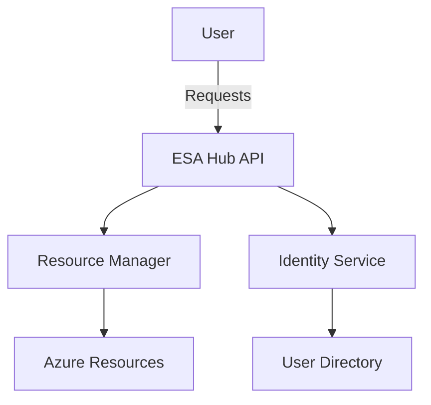
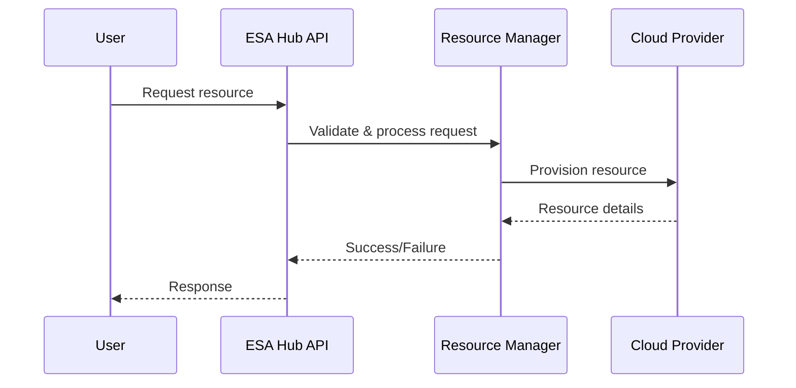
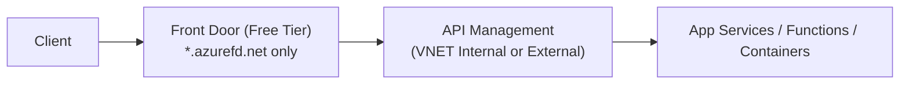
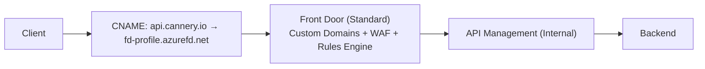
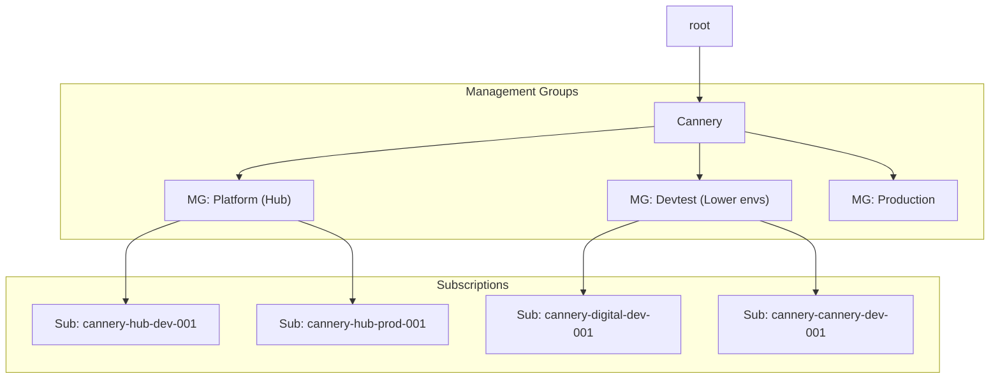

# ESA Hub Documentation

## Overview

The ESA Hub is the central infrastructure component for managing and orchestrating resources across the ESA platform. This document provides an overview of the architecture, components, and workflows.

---

## Architecture Diagram




## Network & DNS Architecture

```mermaid
flowchart TD
  subgraph Hub
    FD[Front Door]
    DNS1[Private DNS Zone: privatelink.azurefd.net]
    DNS2[Private DNS Zone: privatelink.azure-api.net]
    DNSFWD[DNS Forwarder]
  end
  subgraph Spoke
    APIM[API Management (Private Endpoint)]
    APP[App Service (Private Endpoint)]
  end
  FD -- Private Link --> APIM
  APIM -- Private Link --> APP
  DNS1 -- Resolves --> FD
  DNS2 -- Resolves --> APIM
  Hub <--> Spoke
  DNSFWD -- Forwards/Links --> DNS1
  DNSFWD -- Forwards/Links --> DNS2
```

---
## Key Components

- **ESA Hub API**: Entry point for all user and system requests.
- **Resource Manager**: Handles provisioning and management of cloud resources.
- **Identity Service**: Manages authentication and authorization.
- **User Directory**: Stores user and role information.

---

## Workflow Example



---
## Gateway routing

### Azure Front Door Free SKU


- Uses only *.azurefd.net
- Routing rules use basic “forward to origin”
- No custom host headers
- APIM sees traffic normally
- Test everything end-to-end

### Azure Front Door Standard SKU

- Add your api.DOMAIN.com domain
- Bring your Key Vault certs
- Add routing rules
- Optional: Add Private Link → APIM
- Optional: WAF → OWASP CRS protection
- Live production traffic readiness

---

---

## Additional Notes

- All interactions are secured via the Identity Service.
- The hub supports multi-cloud resource management.

---

*For more details, see the related documentation or contact the ESA Hub team.*
Cannery.io — Enterprise Scale Architecture (ESA) Implementation
Version: 2026-01
Author: Robert Good
Model: Hub → Digital‑Dev → Cannery‑Dev
Standard: CAF DR Sortable Naming (sortable, region/env embedded, resource-type suffixes)
Posture: Zero Trust, Cost‑Optimized Startup Edition


1. Goals & Scope

  - Establish a Hub landing zone as the shared platform: networking, DNS, identity, API, edge, observability.
  - Onboard Digital‑Dev (finished SaaS products) and Cannery‑Dev (AI ecosystem / MCP / cans) as spokes/subscriptions.
  - Enforce Zero Trust by default with private endpoints only, no public ingress (except Bastion), and security baselines.
  - Keep costs minimal (no Azure Firewall Premium / no DDoS plan / no WAF initially), while being param‑driven to scale later.


2. Environments & Subscriptions

  **Environments:**
  - Hub – Shared services, platform capabilities.
  - Digital‑Dev – Finished SaaS products (e.g., Digital Insights).
  - Cannery‑Dev – AI ecosystem, SDKs, MCP cans.


  **Subscriptions:**
  - cannery-hub-dev-001 (Hub, now)
  - cannery-hub-prod-001 (Hub, later)
  - cannery-digital-dev-001 (Digital workloads)
  - cannery-cannery-dev-001 (AI/MCP/Cans)
  - Future spokes: one subscription per workload where practical, e.g., cannery-<workload>-dev-###

  **DR:**
  - Design‑only for now. Deploy to centralus later using a separate .bicepparam run.


3. Management Group (MG) Hierarchy & RBAC

  **Hierarchy (ASCII only, no leading slashes):**
  - root
    - Cannery
      - Platform   (Hub landing zones)
      - Devtest    (Digital-Dev, Cannery-Dev)
      - Production (Prod workloads)

  **RBAC:**
  - Developers have higher privileges in Devtest, restricted in Production.

  **Policy Scope:**
  - Core Zero‑Trust policies applied at Platform and inherited downward.

#mermaid-5da018f0-10c3-4e85-ae85-c856a6d3da0b .edge-animation-slow {stroke-dashoffset:900animation-duration:50s;animation-timing-function:linear;animation-delay:0s;animation-iteration-count:infinite;animation-direction:normal;animation-fill-mode:none;animation-play-state:running;animation-name:dash;animation-timeline:auto;animation-range-start:normal;animation-range-end:normal;stroke-linecap:round;stroke-dasharray:9, 5;}
#mermaid-5da018f0-10c3-4e85-ae85-c856a6d3da0b .edge-animation-fast {stroke-dashoffset:900animation-duration:20s;animation-timing-function:linear;animation-delay:0s;animation-iteration-count:infinite;animation-direction:normal;animation-fill-mode:none;animation-play-state:running;animation-name:dash;animation-timeline:auto;animation-range-start:normal;animation-range-end:normal;stroke-linecap:round;stroke-dasharray:9, 5;}
#mermaid-5da018f0-10c3-4e85-ae85-c856a6d3da0b .error-icon {fill:rgb(85, 34, 34)}
#mermaid-5da018f0-10c3-4e85-ae85-c856a6d3da0b .error-text {fill:rgb(85, 34, 34)stroke:rgb(85, 34, 34);}
#mermaid-5da018f0-10c3-4e85-ae85-c856a6d3da0b .edge-thickness-normal {stroke-width:1px}
#mermaid-5da018f0-10c3-4e85-ae85-c856a6d3da0b .edge-thickness-thick {stroke-width:3.5px}
#mermaid-5da018f0-10c3-4e85-ae85-c856a6d3da0b .edge-pattern-solid {stroke-dasharray:0}
#mermaid-5da018f0-10c3-4e85-ae85-c856a6d3da0b .edge-thickness-invisible {stroke-width:0fill:none;}
#mermaid-5da018f0-10c3-4e85-ae85-c856a6d3da0b .edge-pattern-dashed {stroke-dasharray:3}
#mermaid-5da018f0-10c3-4e85-ae85-c856a6d3da0b .edge-pattern-dotted {stroke-dasharray:2}
#mermaid-5da018f0-10c3-4e85-ae85-c856a6d3da0b .marker {fill:rgb(51, 51, 51)stroke:rgb(51, 51, 51);}
#mermaid-5da018f0-10c3-4e85-ae85-c856a6d3da0b .marker.cross {stroke:rgb(51, 51, 51)}
#mermaid-5da018f0-10c3-4e85-ae85-c856a6d3da0b svg {font-family:"trebuchet ms", verdana, arial, sans-seriffont-size:16px;}
#mermaid-5da018f0-10c3-4e85-ae85-c856a6d3da0b p {margin-top:0pxmargin-right:0px;margin-bottom:0px;margin-left:0px;}
#mermaid-5da018f0-10c3-4e85-ae85-c856a6d3da0b .label {font-family:"trebuchet ms", verdana, arial, sans-serifcolor:rgb(51, 51, 51);}
#mermaid-5da018f0-10c3-4e85-ae85-c856a6d3da0b .cluster-label text {fill:rgb(51, 51, 51)}
#mermaid-5da018f0-10c3-4e85-ae85-c856a6d3da0b .cluster-label span {color:rgb(51, 51, 51)}
#mermaid-5da018f0-10c3-4e85-ae85-c856a6d3da0b .cluster-label span p {background-color:transparent}
#mermaid-5da018f0-10c3-4e85-ae85-c856a6d3da0b .label text, #mermaid-5da018f0-10c3-4e85-ae85-c856a6d3da0b span {fill:rgb(51, 51, 51)color:rgb(51, 51, 51);}
#mermaid-5da018f0-10c3-4e85-ae85-c856a6d3da0b .node rect, #mermaid-5da018f0-10c3-4e85-ae85-c856a6d3da0b .node circle, #mermaid-5da018f0-10c3-4e85-ae85-c856a6d3da0b .node ellipse, #mermaid-5da018f0-10c3-4e85-ae85-c856a6d3da0b .node polygon, #mermaid-5da018f0-10c3-4e85-ae85-c856a6d3da0b .node path {fill:rgb(236, 236, 255)stroke:rgb(147, 112, 219);stroke-width:1px;}
#mermaid-5da018f0-10c3-4e85-ae85-c856a6d3da0b .rough-node .label text, #mermaid-5da018f0-10c3-4e85-ae85-c856a6d3da0b .node .label text, #mermaid-5da018f0-10c3-4e85-ae85-c856a6d3da0b .image-shape .label, #mermaid-5da018f0-10c3-4e85-ae85-c856a6d3da0b .icon-shape .label {text-anchor:middle}
#mermaid-5da018f0-10c3-4e85-ae85-c856a6d3da0b .node .katex path {fill:rgb(0, 0, 0)stroke:rgb(0, 0, 0);stroke-width:1px;}
#mermaid-5da018f0-10c3-4e85-ae85-c856a6d3da0b .rough-node .label, #mermaid-5da018f0-10c3-4e85-ae85-c856a6d3da0b .node .label, #mermaid-5da018f0-10c3-4e85-ae85-c856a6d3da0b .image-shape .label, #mermaid-5da018f0-10c3-4e85-ae85-c856a6d3da0b .icon-shape .label {text-align:center}
#mermaid-5da018f0-10c3-4e85-ae85-c856a6d3da0b .node.clickable {cursor:pointer}
#mermaid-5da018f0-10c3-4e85-ae85-c856a6d3da0b .root .anchor path {stroke-width:0stroke:rgb(51, 51, 51);fill:rgb(51, 51, 51);}
#mermaid-5da018f0-10c3-4e85-ae85-c856a6d3da0b .arrowheadPath {fill:rgb(51, 51, 51)}
#mermaid-5da018f0-10c3-4e85-ae85-c856a6d3da0b .edgePath .path {stroke:rgb(51, 51, 51)stroke-width:2px;}
#mermaid-5da018f0-10c3-4e85-ae85-c856a6d3da0b .flowchart-link {stroke:rgb(51, 51, 51)fill:none;}
#mermaid-5da018f0-10c3-4e85-ae85-c856a6d3da0b .edgeLabel {background-color:rgba(232, 232, 232, 0.8)text-align:center;}
#mermaid-5da018f0-10c3-4e85-ae85-c856a6d3da0b .edgeLabel p {background-color:rgba(232, 232, 232, 0.8)}
#mermaid-5da018f0-10c3-4e85-ae85-c856a6d3da0b .edgeLabel rect {opacity:0.5background-color:rgba(232, 232, 232, 0.8);fill:rgba(232, 232, 232, 0.8);}
#mermaid-5da018f0-10c3-4e85-ae85-c856a6d3da0b .labelBkg {background-color:rgba(232, 232, 232, 0.5)}
#mermaid-5da018f0-10c3-4e85-ae85-c856a6d3da0b .cluster rect {fill:rgb(255, 255, 222)stroke:rgb(170, 170, 51);stroke-width:1px;}
#mermaid-5da018f0-10c3-4e85-ae85-c856a6d3da0b .cluster text {fill:rgb(51, 51, 51)}
#mermaid-5da018f0-10c3-4e85-ae85-c856a6d3da0b .cluster span {color:rgb(51, 51, 51)}
#mermaid-5da018f0-10c3-4e85-ae85-c856a6d3da0b div.mermaidTooltip {position:absolutetext-align:center;max-width:200px;padding-top:2px;padding-right:2px;padding-bottom:2px;padding-left:2px;font-family:"trebuchet ms", verdana, arial, sans-serif;font-size:12px;background-image:initial;background-position-x:initial;background-position-y:initial;background-size:initial;background-repeat:initial;background-attachment:initial;background-origin:initial;background-clip:initial;background-color:rgb(249, 255, 236);border-top-width:1px;border-right-width:1px;border-bottom-width:1px;border-left-width:1px;border-top-style:solid;border-right-style:solid;border-bottom-style:solid;border-left-style:solid;border-top-color:rgb(170, 170, 51);border-right-color:rgb(170, 170, 51);border-bottom-color:rgb(170, 170, 51);border-left-color:rgb(170, 170, 51);border-image-source:initial;border-image-slice:initial;border-image-width:initial;border-image-outset:initial;border-image-repeat:initial;border-top-left-radius:2px;border-top-right-radius:2px;border-bottom-right-radius:2px;border-bottom-left-radius:2px;pointer-events:none;z-index:100;}
#mermaid-5da018f0-10c3-4e85-ae85-c856a6d3da0b .flowchartTitleText {text-anchor:middlefont-size:18px;fill:rgb(51, 51, 51);}
#mermaid-5da018f0-10c3-4e85-ae85-c856a6d3da0b rect.text {fill:nonestroke-width:0;}
#mermaid-5da018f0-10c3-4e85-ae85-c856a6d3da0b .icon-shape, #mermaid-5da018f0-10c3-4e85-ae85-c856a6d3da0b .image-shape {background-color:rgba(232, 232, 232, 0.8)text-align:center;}
#mermaid-5da018f0-10c3-4e85-ae85-c856a6d3da0b .icon-shape p, #mermaid-5da018f0-10c3-4e85-ae85-c856a6d3da0b .image-shape p {background-color:rgba(232, 232, 232, 0.8)padding-top:2px;padding-right:2px;padding-bottom:2px;padding-left:2px;}
#mermaid-5da018f0-10c3-4e85-ae85-c856a6d3da0b .icon-shape rect, #mermaid-5da018f0-10c3-4e85-ae85-c856a6d3da0b .image-shape rect {opacity:0.5background-color:rgba(232, 232, 232, 0.8);fill:rgba(232, 232, 232, 0.8);}
#mermaid-5da018f0-10c3-4e85-ae85-c856a6d3da0b .label-icon {display:inline-blockheight:1em;overflow-x:visible;overflow-y:visible;vertical-align:-0.125em;}
#mermaid-5da018f0-10c3-4e85-ae85-c856a6d3da0b .node .label-icon path {fill:currentcolorstroke:revert;stroke-width:revert;}
#mermaid-5da018f0-10c3-4e85-ae85-c856a6d3da0b :root {--mermaid-font-family:"trebuchet ms",verdana,arial,sans-serif}
#mermaid-5da018f0-10c3-4e85-ae85-c856a6d3da0b{font-family:"trebuchet ms",verdana,arial,sans-serif;font-size:16px;fill:#333;}@keyframes edge-animation-frame{from{stroke-dashoffset:0;}}@keyframes dash{to{stroke-dashoffset:0;}}#mermaid-5da018f0-10c3-4e85-ae85-c856a6d3da0b .edge-animation-slow{stroke-dasharray:9,5!important;stroke-dashoffset:900;animation:dash 50s linear infinite;stroke-linecap:round;}#mermaid-5da018f0-10c3-4e85-ae85-c856a6d3da0b .edge-animation-fast{stroke-dasharray:9,5!important;stroke-dashoffset:900;animation:dash 20s linear infinite;stroke-linecap:round;}#mermaid-5da018f0-10c3-4e85-ae85-c856a6d3da0b .error-icon{fill:#552222;}#mermaid-5da018f0-10c3-4e85-ae85-c856a6d3da0b .error-text{fill:#552222;stroke:#552222;}#mermaid-5da018f0-10c3-4e85-ae85-c856a6d3da0b .edge-thickness-normal{stroke-width:1px;}#mermaid-5da018f0-10c3-4e85-ae85-c856a6d3da0b .edge-thickness-thick{stroke-width:3.5px;}#mermaid-5da018f0-10c3-4e85-ae85-c856a6d3da0b .edge-pattern-solid{stroke-dasharray:0;}#mermaid-5da018f0-10c3-4e85-ae85-c856a6d3da0b .edge-thickness-invisible{stroke-width:0;fill:none;}#mermaid-5da018f0-10c3-4e85-ae85-c856a6d3da0b .edge-pattern-dashed{stroke-dasharray:3;}#mermaid-5da018f0-10c3-4e85-ae85-c856a6d3da0b .edge-pattern-dotted{stroke-dasharray:2;}#mermaid-5da018f0-10c3-4e85-ae85-c856a6d3da0b .marker{fill:#333333;stroke:#333333;}#mermaid-5da018f0-10c3-4e85-ae85-c856a6d3da0b .marker.cross{stroke:#333333;}#mermaid-5da018f0-10c3-4e85-ae85-c856a6d3da0b svg{font-family:"trebuchet ms",verdana,arial,sans-serif;font-size:16px;}#mermaid-5da018f0-10c3-4e85-ae85-c856a6d3da0b p{margin:0;}#mermaid-5da018f0-10c3-4e85-ae85-c856a6d3da0b .label{font-family:"trebuchet ms",verdana,arial,sans-serif;color:#333;}#mermaid-5da018f0-10c3-4e85-ae85-c856a6d3da0b .cluster-label text{fill:#333;}#mermaid-5da018f0-10c3-4e85-ae85-c856a6d3da0b .cluster-label span{color:#333;}#mermaid-5da018f0-10c3-4e85-ae85-c856a6d3da0b .cluster-label span p{background-color:transparent;}#mermaid-5da018f0-10c3-4e85-ae85-c856a6d3da0b .label text,#mermaid-5da018f0-10c3-4e85-ae85-c856a6d3da0b span{fill:#333;color:#333;}#mermaid-5da018f0-10c3-4e85-ae85-c856a6d3da0b .node rect,#mermaid-5da018f0-10c3-4e85-ae85-c856a6d3da0b .node circle,#mermaid-5da018f0-10c3-4e85-ae85-c856a6d3da0b .node ellipse,#mermaid-5da018f0-10c3-4e85-ae85-c856a6d3da0b .node polygon,#mermaid-5da018f0-10c3-4e85-ae85-c856a6d3da0b .node path{fill:#ECECFF;stroke:#9370DB;stroke-width:1px;}#mermaid-5da018f0-10c3-4e85-ae85-c856a6d3da0b .rough-node .label text,#mermaid-5da018f0-10c3-4e85-ae85-c856a6d3da0b .node .label text,#mermaid-5da018f0-10c3-4e85-ae85-c856a6d3da0b .image-shape .label,#mermaid-5da018f0-10c3-4e85-ae85-c856a6d3da0b .icon-shape .label{text-anchor:middle;}#mermaid-5da018f0-10c3-4e85-ae85-c856a6d3da0b .node .katex path{fill:#000;stroke:#000;stroke-width:1px;}#mermaid-5da018f0-10c3-4e85-ae85-c856a6d3da0b .rough-node .label,#mermaid-5da018f0-10c3-4e85-ae85-c856a6d3da0b .node .label,#mermaid-5da018f0-10c3-4e85-ae85-c856a6d3da0b .image-shape .label,#mermaid-5da018f0-10c3-4e85-ae85-c856a6d3da0b .icon-shape .label{text-align:center;}#mermaid-5da018f0-10c3-4e85-ae85-c856a6d3da0b .node.clickable{cursor:pointer;}#mermaid-5da018f0-10c3-4e85-ae85-c856a6d3da0b .root .anchor path{fill:#333333!important;stroke-width:0;stroke:#333333;}#mermaid-5da018f0-10c3-4e85-ae85-c856a6d3da0b .arrowheadPath{fill:#333333;}#mermaid-5da018f0-10c3-4e85-ae85-c856a6d3da0b .edgePath .path{stroke:#333333;stroke-width:2.0px;}#mermaid-5da018f0-10c3-4e85-ae85-c856a6d3da0b .flowchart-link{stroke:#333333;fill:none;}#mermaid-5da018f0-10c3-4e85-ae85-c856a6d3da0b .edgeLabel{background-color:rgba(232,232,232, 0.8);text-align:center;}#mermaid-5da018f0-10c3-4e85-ae85-c856a6d3da0b .edgeLabel p{background-color:rgba(232,232,232, 0.8);}#mermaid-5da018f0-10c3-4e85-ae85-c856a6d3da0b .edgeLabel rect{opacity:0.5;background-color:rgba(232,232,232, 0.8);fill:rgba(232,232,232, 0.8);}#mermaid-5da018f0-10c3-4e85-ae85-c856a6d3da0b .labelBkg{background-color:rgba(232, 232, 232, 0.5);}#mermaid-5da018f0-10c3-4e85-ae85-c856a6d3da0b .cluster rect{fill:#ffffde;stroke:#aaaa33;stroke-width:1px;}#mermaid-5da018f0-10c3-4e85-ae85-c856a6d3da0b .cluster text{fill:#333;}#mermaid-5da018f0-10c3-4e85-ae85-c856a6d3da0b .cluster span{color:#333;}#mermaid-5da018f0-10c3-4e85-ae85-c856a6d3da0b div.mermaidTooltip{position:absolute;text-align:center;max-width:200px;padding:2px;font-family:"trebuchet ms",verdana,arial,sans-serif;font-size:12px;background:hsl(80, 100%, 96.2745098039%);border:1px solid #aaaa33;border-radius:2px;pointer-events:none;z-index:100;}#mermaid-5da018f0-10c3-4e85-ae85-c856a6d3da0b .flowchartTitleText{text-anchor:middle;font-size:18px;fill:#333;}#mermaid-5da018f0-10c3-4e85-ae85-c856a6d3da0b rect.text{fill:none;stroke-width:0;}#mermaid-5da018f0-10c3-4e85-ae85-c856a6d3da0b .icon-shape,#mermaid-5da018f0-10c3-4e85-ae85-c856a6d3da0b .image-shape{background-color:rgba(232,232,232, 0.8);text-align:center;}#mermaid-5da018f0-10c3-4e85-ae85-c856a6d3da0b .icon-shape p,#mermaid-5da018f0-10c3-4e85-ae85-c856a6d3da0b .image-shape p{background-color:rgba(232,232,232, 0.8);padding:2px;}#mermaid-5da018f0-10c3-4e85-ae85-c856a6d3da0b .icon-shape rect,#mermaid-5da018f0-10c3-4e85-ae85-c856a6d3da0b .image-shape rect{opacity:0.5;background-color:rgba(232,232,232, 0.8);fill:rgba(232,232,232, 0.8);}#mermaid-5da018f0-10c3-4e85-ae85-c856a6d3da0b .label-icon{display:inline-block;height:1em;overflow:visible;vertical-align:-0.125em;}#mermaid-5da018f0-10c3-4e85-ae85-c856a6d3da0b .node .label-icon path{fill:currentColor;stroke:revert;stroke-width:revert;}#mermaid-5da018f0-10c3-4e85-ae85-c856a6d3da0b :root{--mermaid-font-family:"trebuchet ms",verdana,arial,sans-serif;}SubscriptionsManagement GroupsrootCanneryMG: Platform (Hub)MG: Devtest (Lower envs)MG: ProductionSub: sub-hub-devSub: sub-hub-prodSub: sub-digital-devSub: sub-cannery-devShow more lines

### Management Groups & Subscriptions



4. Regions & DR

Primary Region: westus3 (Arizona)
DR / Paired Region: centralus (optional, deployed when ready)
Templates and .bicepparam files drive multi‑region deployment to keep the implementation simple and reproducible.


5. CAF DR Sortable Naming Conventions
Adopted patterns (sortable, with region/env + resource type suffix). Use consistent 3‑digit sequence (001) per resource family.
Variables

tenant = cannery
mg = platform (platform, devtest, production)
purpose/product = platform (hub‑shared)
env = dev | prod
regionCode = wus3 | cus (West US 3 / Central US)
seq = 001

Patterns

Resource Groups
<tenant>-<mg>-<purpose>-<region>-<###>-rg
e.g., cannery-hubnetwork-wus3-001-rg

Networking
<purpose>-<region>-<###>-vnet
<purpose>-<tier>-<env>-snet
<resource>-<env>-<region>-<###>-nsg
<resource>-<env>-<region>-<###>-pip
<resource>-<env>-<region>-<###>-pe


Edge & API
<purpose>-global-<###>-afd
<purpose>-<env>-endpoint
<product>-<env>-<region>-<routingType>-afdog
<purpose>-<region>-<###>-apim


Identity / Observability
<resource>-<env>-<###>-kv      (Key Vault)
<resource>-<env>-<region>-<###>-log     (Log Analytics workspace)
<resource>-<env>-<region>-<###>-appi    (Application Insights)

DNS

Public zone: cannery.io
Private zone: internal.cannery.io
DNS Private Resolver
<resource>-<env>-<region>-<###>-dnspr
e.g., resolver-dev-wus3-001-dnspr


Private Link zones to pre‑create:
privatelink.azurewebsites.net, privatelink.database.windows.net, privatelink.blob.core.windows.net,
privatelink.queue.core.windows.net, privatelink.table.core.windows.net, privatelink.vaultcore.azure.net,
privatelink.azure-api.net.


6. Resource Group Layout (Hub)
Minimal, clean grouping that matches your patterns and cost posture.
Network
RG: cannery-hubnetwork-wus3-001-rg
Contents: VNet, subnets, Bastion, peering, UDRs
Note: Firewall/DDoS not deployed now
DNS
RG: cannery-platform-dns-wus3-001-rg
Contents: Public cannery.io, Private internal.cannery.io, Private Link zones, DNS Private Resolver
Edge
RG: cannery-platform-edge-wus3-001-rg
Contents: Azure Front Door (Free initially), (WAF later when prod)
API
RG: cannery-platform-api-wus3-001-rg
Contents: API Management (VNET‑internal), Git policy sync
Identity
RG: cannery-platform-identity-wus3-001-rg
Contents: Central Key Vault (purge‑protected, RBAC, private endpoint only)
Mgmt
RG: cannery-platform-mgmt-wus3-001-rg
Contents: Log Analytics (…-log), App Insights (…-appi), Sentinel
Security (optional split)
RG: cannery-platform-security-wus3-001-rg
Contents: Defender/Sentinel content, security automations (optional)
Shared (optional)
RG: cannery-platform-shared-wus3-001-rg

Excluded from Hub: Azure Communication Services (ACS) and user file shares → deploy in spokes/shared‑services if needed.


7. Hub Networking

VNet: platform-wus3-001-vnet (10.10.0.0/20)

Subnets

platform-access-dev-snet (Bastion)
platform-privatelink-dev-snet (Private Endpoints)
platform-dns-inbound-dev-snet (Private Resolver Inbound)
platform-dns-outbound-dev-snet (Private Resolver Outbound)
platform-shared-dev-snet (general services)
(Reserved for later) platform-sec-dev-snet (Firewall) / platform-sec-mgmt-dev-snet (FW Mgmt)

Perimeter

No Azure Firewall Premium (cost)
No DDoS Plan (cost)
Bastion is the only public IP
Private endpoints everywhere possible

Peering

Hub ↔ Spokes (non‑transitive)
No gateway transit (until needed)


8. DNS & Name Resolution

Public Zone: cannery.io in Azure DNS; registrar delegates NS.
Private Split‑Horizon Zone: internal.cannery.io
Private Link Zones for App Services, Storage, SQL, Key Vault, APIM (see list above).
DNS Private Resolver: Inbound + Outbound endpoints in hub VNet.
Spokes link to hub’s private zones and use resolver for central resolution.


9. Edge & APIs
Azure Front Door

Free to start, Standard + WAF at production milestone.
Endpoint naming platform-<env>-endpoint.
Origin = APIM internal endpoint.
Certificates stored in Identity KV; automate renewals.

API Management

VNET‑internal mode (private)
Lowest viable tier that supports VNET + Private Endpoints
GitHub Actions sync for policies
Baseline policies: JWT validation, rate‑limit, CORS, header hygiene
Initial RPS: ~0–10; target 100 RPS in early months

Mermaid: Hub Logical Architecture
flowchart LR  AFD["Azure Front Door\n(platform-global-001-afd)"]  APIM["API Management (VNET-internal)\n(platform-wus3-001-apim)"]  VNET["Hub VNet\n(platform-wus3-001-vnet | 10.10.0.0/20)"]  Bastion["Azure Bastion\n(platform-access-dev-snet)"]  PR["DNS Private Resolver\n(resolver-dev-wus3-001-dnspr)"]  DNSP["Public DNS Zone\ncannery.io"]  DNSI["Private DNS Zone\ninternal.cannery.io"]  KV["Key Vault (Identity)\n(identity-dev-wus3-001-kv)"]  LA["Log Analytics Workspace\n(platform-dev-wus3-001-log)"]  AI["Application Insights\n(platform-dev-wus3-001-appi)"]  AFD --> APIM  APIM --- VNET  VNET --- PR  PR --- DNSI  DNSP -.-> AFD  KV --- VNET  APIM --> KV  AFD --> KV  LA <--> APIM  LA <--> AFD  LA <--> PR  LA <--> KV  AI --> LA  Bastion --- VNET#mermaid-a486e69f-9008-41a3-8fa7-e8bb3bfc23d6 {font-family:"trebuchet ms", verdana, arial, sans-seriffont-size:16px;fill:rgb(51, 51, 51);}
#mermaid-a486e69f-9008-41a3-8fa7-e8bb3bfc23d6 .edge-animation-slow {stroke-dashoffset:900animation-duration:50s;animation-timing-function:linear;animation-delay:0s;animation-iteration-count:infinite;animation-direction:normal;animation-fill-mode:none;animation-play-state:running;animation-name:dash;animation-timeline:auto;animation-range-start:normal;animation-range-end:normal;stroke-linecap:round;stroke-dasharray:9, 5;}
#mermaid-a486e69f-9008-41a3-8fa7-e8bb3bfc23d6 .edge-animation-fast {stroke-dashoffset:900animation-duration:20s;animation-timing-function:linear;animation-delay:0s;animation-iteration-count:infinite;animation-direction:normal;animation-fill-mode:none;animation-play-state:running;animation-name:dash;animation-timeline:auto;animation-range-start:normal;animation-range-end:normal;stroke-linecap:round;stroke-dasharray:9, 5;}
#mermaid-a486e69f-9008-41a3-8fa7-e8bb3bfc23d6 .error-icon {fill:rgb(85, 34, 34)}
#mermaid-a486e69f-9008-41a3-8fa7-e8bb3bfc23d6 .error-text {fill:rgb(85, 34, 34)stroke:rgb(85, 34, 34);}
#mermaid-a486e69f-9008-41a3-8fa7-e8bb3bfc23d6 .edge-thickness-normal {stroke-width:1px}
#mermaid-a486e69f-9008-41a3-8fa7-e8bb3bfc23d6 .edge-thickness-thick {stroke-width:3.5px}
#mermaid-a486e69f-9008-41a3-8fa7-e8bb3bfc23d6 .edge-pattern-solid {stroke-dasharray:0}
#mermaid-a486e69f-9008-41a3-8fa7-e8bb3bfc23d6 .edge-thickness-invisible {stroke-width:0fill:none;}
#mermaid-a486e69f-9008-41a3-8fa7-e8bb3bfc23d6 .edge-pattern-dashed {stroke-dasharray:3}
#mermaid-a486e69f-9008-41a3-8fa7-e8bb3bfc23d6 .edge-pattern-dotted {stroke-dasharray:2}
#mermaid-a486e69f-9008-41a3-8fa7-e8bb3bfc23d6 .marker {fill:rgb(51, 51, 51)stroke:rgb(51, 51, 51);}
#mermaid-a486e69f-9008-41a3-8fa7-e8bb3bfc23d6 .marker.cross {stroke:rgb(51, 51, 51)}
#mermaid-a486e69f-9008-41a3-8fa7-e8bb3bfc23d6 svg {font-family:"trebuchet ms", verdana, arial, sans-seriffont-size:16px;}
#mermaid-a486e69f-9008-41a3-8fa7-e8bb3bfc23d6 p {margin-top:0pxmargin-right:0px;margin-bottom:0px;margin-left:0px;}
#mermaid-a486e69f-9008-41a3-8fa7-e8bb3bfc23d6 .label {font-family:"trebuchet ms", verdana, arial, sans-serifcolor:rgb(51, 51, 51);}
#mermaid-a486e69f-9008-41a3-8fa7-e8bb3bfc23d6 .cluster-label text {fill:rgb(51, 51, 51)}
#mermaid-a486e69f-9008-41a3-8fa7-e8bb3bfc23d6 .cluster-label span {color:rgb(51, 51, 51)}
#mermaid-a486e69f-9008-41a3-8fa7-e8bb3bfc23d6 .cluster-label span p {background-color:transparent}
#mermaid-a486e69f-9008-41a3-8fa7-e8bb3bfc23d6 .label text, #mermaid-a486e69f-9008-41a3-8fa7-e8bb3bfc23d6 span {fill:rgb(51, 51, 51)color:rgb(51, 51, 51);}
#mermaid-a486e69f-9008-41a3-8fa7-e8bb3bfc23d6 .node rect, #mermaid-a486e69f-9008-41a3-8fa7-e8bb3bfc23d6 .node circle, #mermaid-a486e69f-9008-41a3-8fa7-e8bb3bfc23d6 .node ellipse, #mermaid-a486e69f-9008-41a3-8fa7-e8bb3bfc23d6 .node polygon, #mermaid-a486e69f-9008-41a3-8fa7-e8bb3bfc23d6 .node path {fill:rgb(236, 236, 255)stroke:rgb(147, 112, 219);stroke-width:1px;}
#mermaid-a486e69f-9008-41a3-8fa7-e8bb3bfc23d6 .rough-node .label text, #mermaid-a486e69f-9008-41a3-8fa7-e8bb3bfc23d6 .node .label text, #mermaid-a486e69f-9008-41a3-8fa7-e8bb3bfc23d6 .image-shape .label, #mermaid-a486e69f-9008-41a3-8fa7-e8bb3bfc23d6 .icon-shape .label {text-anchor:middle}
#mermaid-a486e69f-9008-41a3-8fa7-e8bb3bfc23d6 .node .katex path {fill:rgb(0, 0, 0)stroke:rgb(0, 0, 0);stroke-width:1px;}
#mermaid-a486e69f-9008-41a3-8fa7-e8bb3bfc23d6 .rough-node .label, #mermaid-a486e69f-9008-41a3-8fa7-e8bb3bfc23d6 .node .label, #mermaid-a486e69f-9008-41a3-8fa7-e8bb3bfc23d6 .image-shape .label, #mermaid-a486e69f-9008-41a3-8fa7-e8bb3bfc23d6 .icon-shape .label {text-align:center}
#mermaid-a486e69f-9008-41a3-8fa7-e8bb3bfc23d6 .node.clickable {cursor:pointer}
#mermaid-a486e69f-9008-41a3-8fa7-e8bb3bfc23d6 .root .anchor path {stroke-width:0stroke:rgb(51, 51, 51);fill:rgb(51, 51, 51);}
#mermaid-a486e69f-9008-41a3-8fa7-e8bb3bfc23d6 .arrowheadPath {fill:rgb(51, 51, 51)}
#mermaid-a486e69f-9008-41a3-8fa7-e8bb3bfc23d6 .edgePath .path {stroke:rgb(51, 51, 51)stroke-width:2px;}
#mermaid-a486e69f-9008-41a3-8fa7-e8bb3bfc23d6 .flowchart-link {stroke:rgb(51, 51, 51)fill:none;}
#mermaid-a486e69f-9008-41a3-8fa7-e8bb3bfc23d6 .edgeLabel {background-color:rgba(232, 232, 232, 0.8)text-align:center;}
#mermaid-a486e69f-9008-41a3-8fa7-e8bb3bfc23d6 .edgeLabel p {background-color:rgba(232, 232, 232, 0.8)}
#mermaid-a486e69f-9008-41a3-8fa7-e8bb3bfc23d6 .edgeLabel rect {opacity:0.5background-color:rgba(232, 232, 232, 0.8);fill:rgba(232, 232, 232, 0.8);}
#mermaid-a486e69f-9008-41a3-8fa7-e8bb3bfc23d6 .labelBkg {background-color:rgba(232, 232, 232, 0.5)}
#mermaid-a486e69f-9008-41a3-8fa7-e8bb3bfc23d6 .cluster rect {fill:rgb(255, 255, 222)stroke:rgb(170, 170, 51);stroke-width:1px;}
#mermaid-a486e69f-9008-41a3-8fa7-e8bb3bfc23d6 .cluster text {fill:rgb(51, 51, 51)}
#mermaid-a486e69f-9008-41a3-8fa7-e8bb3bfc23d6 .cluster span {color:rgb(51, 51, 51)}
#mermaid-a486e69f-9008-41a3-8fa7-e8bb3bfc23d6 div.mermaidTooltip {position:absolutetext-align:center;max-width:200px;padding-top:2px;padding-right:2px;padding-bottom:2px;padding-left:2px;font-family:"trebuchet ms", verdana, arial, sans-serif;font-size:12px;background-image:initial;background-position-x:initial;background-position-y:initial;background-size:initial;background-repeat:initial;background-attachment:initial;background-origin:initial;background-clip:initial;background-color:rgb(249, 255, 236);border-top-width:1px;border-right-width:1px;border-bottom-width:1px;border-left-width:1px;border-top-style:solid;border-right-style:solid;border-bottom-style:solid;border-left-style:solid;border-top-color:rgb(170, 170, 51);border-right-color:rgb(170, 170, 51);border-bottom-color:rgb(170, 170, 51);border-left-color:rgb(170, 170, 51);border-image-source:initial;border-image-slice:initial;border-image-width:initial;border-image-outset:initial;border-image-repeat:initial;border-top-left-radius:2px;border-top-right-radius:2px;border-bottom-right-radius:2px;border-bottom-left-radius:2px;pointer-events:none;z-index:100;}
#mermaid-a486e69f-9008-41a3-8fa7-e8bb3bfc23d6 .flowchartTitleText {text-anchor:middlefont-size:18px;fill:rgb(51, 51, 51);}
#mermaid-a486e69f-9008-41a3-8fa7-e8bb3bfc23d6 rect.text {fill:nonestroke-width:0;}
#mermaid-a486e69f-9008-41a3-8fa7-e8bb3bfc23d6 .icon-shape, #mermaid-a486e69f-9008-41a3-8fa7-e8bb3bfc23d6 .image-shape {background-color:rgba(232, 232, 232, 0.8)text-align:center;}
#mermaid-a486e69f-9008-41a3-8fa7-e8bb3bfc23d6 .icon-shape p, #mermaid-a486e69f-9008-41a3-8fa7-e8bb3bfc23d6 .image-shape p {background-color:rgba(232, 232, 232, 0.8)padding-top:2px;padding-right:2px;padding-bottom:2px;padding-left:2px;}
#mermaid-a486e69f-9008-41a3-8fa7-e8bb3bfc23d6 .icon-shape rect, #mermaid-a486e69f-9008-41a3-8fa7-e8bb3bfc23d6 .image-shape rect {opacity:0.5background-color:rgba(232, 232, 232, 0.8);fill:rgba(232, 232, 232, 0.8);}
#mermaid-a486e69f-9008-41a3-8fa7-e8bb3bfc23d6 .label-icon {display:inline-blockheight:1em;overflow-x:visible;overflow-y:visible;vertical-align:-0.125em;}
#mermaid-a486e69f-9008-41a3-8fa7-e8bb3bfc23d6 .node .label-icon path {fill:currentcolorstroke:revert;stroke-width:revert;}
#mermaid-a486e69f-9008-41a3-8fa7-e8bb3bfc23d6 :root {--mermaid-font-family:"trebuchet ms",verdana,arial,sans-serif}
#mermaid-a486e69f-9008-41a3-8fa7-e8bb3bfc23d6{font-family:"trebuchet ms",verdana,arial,sans-serif;font-size:16px;fill:#333;}@keyframes edge-animation-frame{from{stroke-dashoffset:0;}}@keyframes dash{to{stroke-dashoffset:0;}}#mermaid-a486e69f-9008-41a3-8fa7-e8bb3bfc23d6 .edge-animation-slow{stroke-dasharray:9,5!important;stroke-dashoffset:900;animation:dash 50s linear infinite;stroke-linecap:round;}#mermaid-a486e69f-9008-41a3-8fa7-e8bb3bfc23d6 .edge-animation-fast{stroke-dasharray:9,5!important;stroke-dashoffset:900;animation:dash 20s linear infinite;stroke-linecap:round;}#mermaid-a486e69f-9008-41a3-8fa7-e8bb3bfc23d6 .error-icon{fill:#552222;}#mermaid-a486e69f-9008-41a3-8fa7-e8bb3bfc23d6 .error-text{fill:#552222;stroke:#552222;}#mermaid-a486e69f-9008-41a3-8fa7-e8bb3bfc23d6 .edge-thickness-normal{stroke-width:1px;}#mermaid-a486e69f-9008-41a3-8fa7-e8bb3bfc23d6 .edge-thickness-thick{stroke-width:3.5px;}#mermaid-a486e69f-9008-41a3-8fa7-e8bb3bfc23d6 .edge-pattern-solid{stroke-dasharray:0;}#mermaid-a486e69f-9008-41a3-8fa7-e8bb3bfc23d6 .edge-thickness-invisible{stroke-width:0;fill:none;}#mermaid-a486e69f-9008-41a3-8fa7-e8bb3bfc23d6 .edge-pattern-dashed{stroke-dasharray:3;}#mermaid-a486e69f-9008-41a3-8fa7-e8bb3bfc23d6 .edge-pattern-dotted{stroke-dasharray:2;}#mermaid-a486e69f-9008-41a3-8fa7-e8bb3bfc23d6 .marker{fill:#333333;stroke:#333333;}#mermaid-a486e69f-9008-41a3-8fa7-e8bb3bfc23d6 .marker.cross{stroke:#333333;}#mermaid-a486e69f-9008-41a3-8fa7-e8bb3bfc23d6 svg{font-family:"trebuchet ms",verdana,arial,sans-serif;font-size:16px;}#mermaid-a486e69f-9008-41a3-8fa7-e8bb3bfc23d6 p{margin:0;}#mermaid-a486e69f-9008-41a3-8fa7-e8bb3bfc23d6 .label{font-family:"trebuchet ms",verdana,arial,sans-serif;color:#333;}#mermaid-a486e69f-9008-41a3-8fa7-e8bb3bfc23d6 .cluster-label text{fill:#333;}#mermaid-a486e69f-9008-41a3-8fa7-e8bb3bfc23d6 .cluster-label span{color:#333;}#mermaid-a486e69f-9008-41a3-8fa7-e8bb3bfc23d6 .cluster-label span p{background-color:transparent;}#mermaid-a486e69f-9008-41a3-8fa7-e8bb3bfc23d6 .label text,#mermaid-a486e69f-9008-41a3-8fa7-e8bb3bfc23d6 span{fill:#333;color:#333;}#mermaid-a486e69f-9008-41a3-8fa7-e8bb3bfc23d6 .node rect,#mermaid-a486e69f-9008-41a3-8fa7-e8bb3bfc23d6 .node circle,#mermaid-a486e69f-9008-41a3-8fa7-e8bb3bfc23d6 .node ellipse,#mermaid-a486e69f-9008-41a3-8fa7-e8bb3bfc23d6 .node polygon,#mermaid-a486e69f-9008-41a3-8fa7-e8bb3bfc23d6 .node path{fill:#ECECFF;stroke:#9370DB;stroke-width:1px;}#mermaid-a486e69f-9008-41a3-8fa7-e8bb3bfc23d6 .rough-node .label text,#mermaid-a486e69f-9008-41a3-8fa7-e8bb3bfc23d6 .node .label text,#mermaid-a486e69f-9008-41a3-8fa7-e8bb3bfc23d6 .image-shape .label,#mermaid-a486e69f-9008-41a3-8fa7-e8bb3bfc23d6 .icon-shape .label{text-anchor:middle;}#mermaid-a486e69f-9008-41a3-8fa7-e8bb3bfc23d6 .node .katex path{fill:#000;stroke:#000;stroke-width:1px;}#mermaid-a486e69f-9008-41a3-8fa7-e8bb3bfc23d6 .rough-node .label,#mermaid-a486e69f-9008-41a3-8fa7-e8bb3bfc23d6 .node .label,#mermaid-a486e69f-9008-41a3-8fa7-e8bb3bfc23d6 .image-shape .label,#mermaid-a486e69f-9008-41a3-8fa7-e8bb3bfc23d6 .icon-shape .label{text-align:center;}#mermaid-a486e69f-9008-41a3-8fa7-e8bb3bfc23d6 .node.clickable{cursor:pointer;}#mermaid-a486e69f-9008-41a3-8fa7-e8bb3bfc23d6 .root .anchor path{fill:#333333!important;stroke-width:0;stroke:#333333;}#mermaid-a486e69f-9008-41a3-8fa7-e8bb3bfc23d6 .arrowheadPath{fill:#333333;}#mermaid-a486e69f-9008-41a3-8fa7-e8bb3bfc23d6 .edgePath .path{stroke:#333333;stroke-width:2.0px;}#mermaid-a486e69f-9008-41a3-8fa7-e8bb3bfc23d6 .flowchart-link{stroke:#333333;fill:none;}#mermaid-a486e69f-9008-41a3-8fa7-e8bb3bfc23d6 .edgeLabel{background-color:rgba(232,232,232, 0.8);text-align:center;}#mermaid-a486e69f-9008-41a3-8fa7-e8bb3bfc23d6 .edgeLabel p{background-color:rgba(232,232,232, 0.8);}#mermaid-a486e69f-9008-41a3-8fa7-e8bb3bfc23d6 .edgeLabel rect{opacity:0.5;background-color:rgba(232,232,232, 0.8);fill:rgba(232,232,232, 0.8);}#mermaid-a486e69f-9008-41a3-8fa7-e8bb3bfc23d6 .labelBkg{background-color:rgba(232, 232, 232, 0.5);}#mermaid-a486e69f-9008-41a3-8fa7-e8bb3bfc23d6 .cluster rect{fill:#ffffde;stroke:#aaaa33;stroke-width:1px;}#mermaid-a486e69f-9008-41a3-8fa7-e8bb3bfc23d6 .cluster text{fill:#333;}#mermaid-a486e69f-9008-41a3-8fa7-e8bb3bfc23d6 .cluster span{color:#333;}#mermaid-a486e69f-9008-41a3-8fa7-e8bb3bfc23d6 div.mermaidTooltip{position:absolute;text-align:center;max-width:200px;padding:2px;font-family:"trebuchet ms",verdana,arial,sans-serif;font-size:12px;background:hsl(80, 100%, 96.2745098039%);border:1px solid #aaaa33;border-radius:2px;pointer-events:none;z-index:100;}#mermaid-a486e69f-9008-41a3-8fa7-e8bb3bfc23d6 .flowchartTitleText{text-anchor:middle;font-size:18px;fill:#333;}#mermaid-a486e69f-9008-41a3-8fa7-e8bb3bfc23d6 rect.text{fill:none;stroke-width:0;}#mermaid-a486e69f-9008-41a3-8fa7-e8bb3bfc23d6 .icon-shape,#mermaid-a486e69f-9008-41a3-8fa7-e8bb3bfc23d6 .image-shape{background-color:rgba(232,232,232, 0.8);text-align:center;}#mermaid-a486e69f-9008-41a3-8fa7-e8bb3bfc23d6 .icon-shape p,#mermaid-a486e69f-9008-41a3-8fa7-e8bb3bfc23d6 .image-shape p{background-color:rgba(232,232,232, 0.8);padding:2px;}#mermaid-a486e69f-9008-41a3-8fa7-e8bb3bfc23d6 .icon-shape rect,#mermaid-a486e69f-9008-41a3-8fa7-e8bb3bfc23d6 .image-shape rect{opacity:0.5;background-color:rgba(232,232,232, 0.8);fill:rgba(232,232,232, 0.8);}#mermaid-a486e69f-9008-41a3-8fa7-e8bb3bfc23d6 .label-icon{display:inline-block;height:1em;overflow:visible;vertical-align:-0.125em;}#mermaid-a486e69f-9008-41a3-8fa7-e8bb3bfc23d6 .node .label-icon path{fill:currentColor;stroke:revert;stroke-width:revert;}#mermaid-a486e69f-9008-41a3-8fa7-e8bb3bfc23d6 :root{--mermaid-font-family:"trebuchet ms",verdana,arial,sans-serif;}Azure FrontDoor\n(platform-global-001-afd)API Management(VNET-internal)\n(platform-wus3-001-apim)HubVNet\n(platform-wus3-001-vnet | 10.10.0.0/20)AzureBastion\n(platform-access-dev-snet)DNS PrivateResolver\n(resolver-dev-wus3-001-dnspr)Public DNSZone\ncannery.ioPrivate DNSZone\ninternal.cannery.ioKey Vault(Identity)\n(identity-dev-wus3-001-kv)Log AnalyticsWorkspace\n(platform-dev-wus3-001-log)ApplicationInsights\n(platform-dev-wus3-001-appi)Show more lines

10. Identity & Secrets

Key Vault: identity-<env>-<region>-<###>-kv

Purge protection: Enabled
Soft delete: Enabled
RBAC only (AAD auth), access via managed identity
Private endpoint only (public disabled)


Managed Identity: default for all workloads (avoid client secrets)
Entra External ID: planned (not deployed)


11. Security & Zero Trust Guardrails

Deny public network access where Private Link exists (Key Vault, Storage, SQL, etc.)
Require Private Endpoints for supported PaaS
TLS 1.2+ everywhere, no local auth
No inbound NSGs except Bastion
Diagnostic settings to central Log Analytics + archival Storage
Defender for Cloud: enable free tier → scale up as needed
Microsoft Sentinel: enabled on central workspace, pay‑as‑you‑go, minimal connectors initially
PIM for privileged roles


12. Observability & Diagnostics

Log Analytics Workspace: platform-<env>-<region>-<###>-log

Retention: 30–60 days


Application Insights: platform-<env>-<region>-<###>-appi (workspace‑based)
Diagnostic Settings: AFD, APIM, Bastion, DNS Resolver, Key Vault, Storage → Log Analytics + Storage (hot → cool via lifecycle)


13. Access & RBAC

Network RG → Network Contributor
Security RG → Security Admin / Sentinel Contributor
Mgmt RG → Monitoring Contributor / Log Analytics Contributor
Readers → all other scopes for visibility
PIM enforced
Break‑glass: two cloud‑only accounts (MFA exemption only, tightly controlled)


14. Cost Controls

Subscription budgets with 50/75/90% alerts
Cost anomaly alerts
Storage lifecycle policies (hot → cool)
Defer paid perimeter services (Firewall Premium, DDoS, WAF) until needed


15. Spoke Pattern (Digital‑Dev & Cannery‑Dev)

Private Endpoints only
No public ingress
DNS links to hub private zones + resolver outbound/inbound as needed
APIM calls into spoke backends through VNET (internal)
Optional shared‑services spoke for ACS and file shares if required later

Mermaid: Hub–Spoke Topology
flowchart TB  subgraph HUB["Hub (sub-hub-dev)"]    VNET["Hub VNet\nplatform-wus3-001-vnet"]    PR["DNS Private Resolver"]    DNSI["Private DNS: internal.cannery.io"]    APIM["APIM (internal)"]    AFD["Front Door"]    KV["Identity KV"]    LA["Log Analytics"]    AI["App Insights"]    Bastion["Bastion"]  end  subgraph SPOKE1["Spoke: Digital-Dev"]    VNET1["Spoke VNet"]    PE1["Private Endpoints"]    APP1["Workload Services"]  end  subgraph SPOKE2["Spoke: Cannery-Dev"]    VNET2["Spoke VNet"]    PE2["Private Endpoints"]    APP2["Workload Services"]  end  AFD --> APIM  APIM --- VNET  VNET --- VNET1  VNET --- VNET2  PR --- DNSI  VNET1 --- PR  VNET2 --- PR  APP1 --> PE1 --> APIM  APP2 --> PE2 --> APIM  KV --- VNET  LA --- APIM  LA --- AFD  LA --- PR  LA --- KV  AI --> LA  Bastion --- VNET#mermaid-60158602-8bbe-4a8f-9f63-94d1220e5cd2 {font-family:"trebuchet ms", verdana, arial, sans-seriffont-size:16px;fill:rgb(51, 51, 51);}
#mermaid-60158602-8bbe-4a8f-9f63-94d1220e5cd2 .edge-animation-slow {stroke-dashoffset:900animation-duration:50s;animation-timing-function:linear;animation-delay:0s;animation-iteration-count:infinite;animation-direction:normal;animation-fill-mode:none;animation-play-state:running;animation-name:dash;animation-timeline:auto;animation-range-start:normal;animation-range-end:normal;stroke-linecap:round;stroke-dasharray:9, 5;}
#mermaid-60158602-8bbe-4a8f-9f63-94d1220e5cd2 .edge-animation-fast {stroke-dashoffset:900animation-duration:20s;animation-timing-function:linear;animation-delay:0s;animation-iteration-count:infinite;animation-direction:normal;animation-fill-mode:none;animation-play-state:running;animation-name:dash;animation-timeline:auto;animation-range-start:normal;animation-range-end:normal;stroke-linecap:round;stroke-dasharray:9, 5;}
#mermaid-60158602-8bbe-4a8f-9f63-94d1220e5cd2 .error-icon {fill:rgb(85, 34, 34)}
#mermaid-60158602-8bbe-4a8f-9f63-94d1220e5cd2 .error-text {fill:rgb(85, 34, 34)stroke:rgb(85, 34, 34);}
#mermaid-60158602-8bbe-4a8f-9f63-94d1220e5cd2 .edge-thickness-normal {stroke-width:1px}
#mermaid-60158602-8bbe-4a8f-9f63-94d1220e5cd2 .edge-thickness-thick {stroke-width:3.5px}
#mermaid-60158602-8bbe-4a8f-9f63-94d1220e5cd2 .edge-pattern-solid {stroke-dasharray:0}
#mermaid-60158602-8bbe-4a8f-9f63-94d1220e5cd2 .edge-thickness-invisible {stroke-width:0fill:none;}
#mermaid-60158602-8bbe-4a8f-9f63-94d1220e5cd2 .edge-pattern-dashed {stroke-dasharray:3}
#mermaid-60158602-8bbe-4a8f-9f63-94d1220e5cd2 .edge-pattern-dotted {stroke-dasharray:2}
#mermaid-60158602-8bbe-4a8f-9f63-94d1220e5cd2 .marker {fill:rgb(51, 51, 51)stroke:rgb(51, 51, 51);}
#mermaid-60158602-8bbe-4a8f-9f63-94d1220e5cd2 .marker.cross {stroke:rgb(51, 51, 51)}
#mermaid-60158602-8bbe-4a8f-9f63-94d1220e5cd2 svg {font-family:"trebuchet ms", verdana, arial, sans-seriffont-size:16px;}
#mermaid-60158602-8bbe-4a8f-9f63-94d1220e5cd2 p {margin-top:0pxmargin-right:0px;margin-bottom:0px;margin-left:0px;}
#mermaid-60158602-8bbe-4a8f-9f63-94d1220e5cd2 .label {font-family:"trebuchet ms", verdana, arial, sans-serifcolor:rgb(51, 51, 51);}
#mermaid-60158602-8bbe-4a8f-9f63-94d1220e5cd2 .cluster-label text {fill:rgb(51, 51, 51)}
#mermaid-60158602-8bbe-4a8f-9f63-94d1220e5cd2 .cluster-label span {color:rgb(51, 51, 51)}
#mermaid-60158602-8bbe-4a8f-9f63-94d1220e5cd2 .cluster-label span p {background-color:transparent}
#mermaid-60158602-8bbe-4a8f-9f63-94d1220e5cd2 .label text, #mermaid-60158602-8bbe-4a8f-9f63-94d1220e5cd2 span {fill:rgb(51, 51, 51)color:rgb(51, 51, 51);}
#mermaid-60158602-8bbe-4a8f-9f63-94d1220e5cd2 .node rect, #mermaid-60158602-8bbe-4a8f-9f63-94d1220e5cd2 .node circle, #mermaid-60158602-8bbe-4a8f-9f63-94d1220e5cd2 .node ellipse, #mermaid-60158602-8bbe-4a8f-9f63-94d1220e5cd2 .node polygon, #mermaid-60158602-8bbe-4a8f-9f63-94d1220e5cd2 .node path {fill:rgb(236, 236, 255)stroke:rgb(147, 112, 219);stroke-width:1px;}
#mermaid-60158602-8bbe-4a8f-9f63-94d1220e5cd2 .rough-node .label text, #mermaid-60158602-8bbe-4a8f-9f63-94d1220e5cd2 .node .label text, #mermaid-60158602-8bbe-4a8f-9f63-94d1220e5cd2 .image-shape .label, #mermaid-60158602-8bbe-4a8f-9f63-94d1220e5cd2 .icon-shape .label {text-anchor:middle}
#mermaid-60158602-8bbe-4a8f-9f63-94d1220e5cd2 .node .katex path {fill:rgb(0, 0, 0)stroke:rgb(0, 0, 0);stroke-width:1px;}
#mermaid-60158602-8bbe-4a8f-9f63-94d1220e5cd2 .rough-node .label, #mermaid-60158602-8bbe-4a8f-9f63-94d1220e5cd2 .node .label, #mermaid-60158602-8bbe-4a8f-9f63-94d1220e5cd2 .image-shape .label, #mermaid-60158602-8bbe-4a8f-9f63-94d1220e5cd2 .icon-shape .label {text-align:center}
#mermaid-60158602-8bbe-4a8f-9f63-94d1220e5cd2 .node.clickable {cursor:pointer}
#mermaid-60158602-8bbe-4a8f-9f63-94d1220e5cd2 .root .anchor path {stroke-width:0stroke:rgb(51, 51, 51);fill:rgb(51, 51, 51);}
#mermaid-60158602-8bbe-4a8f-9f63-94d1220e5cd2 .arrowheadPath {fill:rgb(51, 51, 51)}
#mermaid-60158602-8bbe-4a8f-9f63-94d1220e5cd2 .edgePath .path {stroke:rgb(51, 51, 51)stroke-width:2px;}
#mermaid-60158602-8bbe-4a8f-9f63-94d1220e5cd2 .flowchart-link {stroke:rgb(51, 51, 51)fill:none;}
#mermaid-60158602-8bbe-4a8f-9f63-94d1220e5cd2 .edgeLabel {background-color:rgba(232, 232, 232, 0.8)text-align:center;}
#mermaid-60158602-8bbe-4a8f-9f63-94d1220e5cd2 .edgeLabel p {background-color:rgba(232, 232, 232, 0.8)}
#mermaid-60158602-8bbe-4a8f-9f63-94d1220e5cd2 .edgeLabel rect {opacity:0.5background-color:rgba(232, 232, 232, 0.8);fill:rgba(232, 232, 232, 0.8);}
#mermaid-60158602-8bbe-4a8f-9f63-94d1220e5cd2 .labelBkg {background-color:rgba(232, 232, 232, 0.5)}
#mermaid-60158602-8bbe-4a8f-9f63-94d1220e5cd2 .cluster rect {fill:rgb(255, 255, 222)stroke:rgb(170, 170, 51);stroke-width:1px;}
#mermaid-60158602-8bbe-4a8f-9f63-94d1220e5cd2 .cluster text {fill:rgb(51, 51, 51)}
#mermaid-60158602-8bbe-4a8f-9f63-94d1220e5cd2 .cluster span {color:rgb(51, 51, 51)}
#mermaid-60158602-8bbe-4a8f-9f63-94d1220e5cd2 div.mermaidTooltip {position:absolutetext-align:center;max-width:200px;padding-top:2px;padding-right:2px;padding-bottom:2px;padding-left:2px;font-family:"trebuchet ms", verdana, arial, sans-serif;font-size:12px;background-image:initial;background-position-x:initial;background-position-y:initial;background-size:initial;background-repeat:initial;background-attachment:initial;background-origin:initial;background-clip:initial;background-color:rgb(249, 255, 236);border-top-width:1px;border-right-width:1px;border-bottom-width:1px;border-left-width:1px;border-top-style:solid;border-right-style:solid;border-bottom-style:solid;border-left-style:solid;border-top-color:rgb(170, 170, 51);border-right-color:rgb(170, 170, 51);border-bottom-color:rgb(170, 170, 51);border-left-color:rgb(170, 170, 51);border-image-source:initial;border-image-slice:initial;border-image-width:initial;border-image-outset:initial;border-image-repeat:initial;border-top-left-radius:2px;border-top-right-radius:2px;border-bottom-right-radius:2px;border-bottom-left-radius:2px;pointer-events:none;z-index:100;}
#mermaid-60158602-8bbe-4a8f-9f63-94d1220e5cd2 .flowchartTitleText {text-anchor:middlefont-size:18px;fill:rgb(51, 51, 51);}
#mermaid-60158602-8bbe-4a8f-9f63-94d1220e5cd2 rect.text {fill:nonestroke-width:0;}
#mermaid-60158602-8bbe-4a8f-9f63-94d1220e5cd2 .icon-shape, #mermaid-60158602-8bbe-4a8f-9f63-94d1220e5cd2 .image-shape {background-color:rgba(232, 232, 232, 0.8)text-align:center;}
#mermaid-60158602-8bbe-4a8f-9f63-94d1220e5cd2 .icon-shape p, #mermaid-60158602-8bbe-4a8f-9f63-94d1220e5cd2 .image-shape p {background-color:rgba(232, 232, 232, 0.8)padding-top:2px;padding-right:2px;padding-bottom:2px;padding-left:2px;}
#mermaid-60158602-8bbe-4a8f-9f63-94d1220e5cd2 .icon-shape rect, #mermaid-60158602-8bbe-4a8f-9f63-94d1220e5cd2 .image-shape rect {opacity:0.5background-color:rgba(232, 232, 232, 0.8);fill:rgba(232, 232, 232, 0.8);}
#mermaid-60158602-8bbe-4a8f-9f63-94d1220e5cd2 .label-icon {display:inline-blockheight:1em;overflow-x:visible;overflow-y:visible;vertical-align:-0.125em;}
#mermaid-60158602-8bbe-4a8f-9f63-94d1220e5cd2 .node .label-icon path {fill:currentcolorstroke:revert;stroke-width:revert;}
#mermaid-60158602-8bbe-4a8f-9f63-94d1220e5cd2 :root {--mermaid-font-family:"trebuchet ms",verdana,arial,sans-serif}
#mermaid-60158602-8bbe-4a8f-9f63-94d1220e5cd2{font-family:"trebuchet ms",verdana,arial,sans-serif;font-size:16px;fill:#333;}@keyframes edge-animation-frame{from{stroke-dashoffset:0;}}@keyframes dash{to{stroke-dashoffset:0;}}#mermaid-60158602-8bbe-4a8f-9f63-94d1220e5cd2 .edge-animation-slow{stroke-dasharray:9,5!important;stroke-dashoffset:900;animation:dash 50s linear infinite;stroke-linecap:round;}#mermaid-60158602-8bbe-4a8f-9f63-94d1220e5cd2 .edge-animation-fast{stroke-dasharray:9,5!important;stroke-dashoffset:900;animation:dash 20s linear infinite;stroke-linecap:round;}#mermaid-60158602-8bbe-4a8f-9f63-94d1220e5cd2 .error-icon{fill:#552222;}#mermaid-60158602-8bbe-4a8f-9f63-94d1220e5cd2 .error-text{fill:#552222;stroke:#552222;}#mermaid-60158602-8bbe-4a8f-9f63-94d1220e5cd2 .edge-thickness-normal{stroke-width:1px;}#mermaid-60158602-8bbe-4a8f-9f63-94d1220e5cd2 .edge-thickness-thick{stroke-width:3.5px;}#mermaid-60158602-8bbe-4a8f-9f63-94d1220e5cd2 .edge-pattern-solid{stroke-dasharray:0;}#mermaid-60158602-8bbe-4a8f-9f63-94d1220e5cd2 .edge-thickness-invisible{stroke-width:0;fill:none;}#mermaid-60158602-8bbe-4a8f-9f63-94d1220e5cd2 .edge-pattern-dashed{stroke-dasharray:3;}#mermaid-60158602-8bbe-4a8f-9f63-94d1220e5cd2 .edge-pattern-dotted{stroke-dasharray:2;}#mermaid-60158602-8bbe-4a8f-9f63-94d1220e5cd2 .marker{fill:#333333;stroke:#333333;}#mermaid-60158602-8bbe-4a8f-9f63-94d1220e5cd2 .marker.cross{stroke:#333333;}#mermaid-60158602-8bbe-4a8f-9f63-94d1220e5cd2 svg{font-family:"trebuchet ms",verdana,arial,sans-serif;font-size:16px;}#mermaid-60158602-8bbe-4a8f-9f63-94d1220e5cd2 p{margin:0;}#mermaid-60158602-8bbe-4a8f-9f63-94d1220e5cd2 .label{font-family:"trebuchet ms",verdana,arial,sans-serif;color:#333;}#mermaid-60158602-8bbe-4a8f-9f63-94d1220e5cd2 .cluster-label text{fill:#333;}#mermaid-60158602-8bbe-4a8f-9f63-94d1220e5cd2 .cluster-label span{color:#333;}#mermaid-60158602-8bbe-4a8f-9f63-94d1220e5cd2 .cluster-label span p{background-color:transparent;}#mermaid-60158602-8bbe-4a8f-9f63-94d1220e5cd2 .label text,#mermaid-60158602-8bbe-4a8f-9f63-94d1220e5cd2 span{fill:#333;color:#333;}#mermaid-60158602-8bbe-4a8f-9f63-94d1220e5cd2 .node rect,#mermaid-60158602-8bbe-4a8f-9f63-94d1220e5cd2 .node circle,#mermaid-60158602-8bbe-4a8f-9f63-94d1220e5cd2 .node ellipse,#mermaid-60158602-8bbe-4a8f-9f63-94d1220e5cd2 .node polygon,#mermaid-60158602-8bbe-4a8f-9f63-94d1220e5cd2 .node path{fill:#ECECFF;stroke:#9370DB;stroke-width:1px;}#mermaid-60158602-8bbe-4a8f-9f63-94d1220e5cd2 .rough-node .label text,#mermaid-60158602-8bbe-4a8f-9f63-94d1220e5cd2 .node .label text,#mermaid-60158602-8bbe-4a8f-9f63-94d1220e5cd2 .image-shape .label,#mermaid-60158602-8bbe-4a8f-9f63-94d1220e5cd2 .icon-shape .label{text-anchor:middle;}#mermaid-60158602-8bbe-4a8f-9f63-94d1220e5cd2 .node .katex path{fill:#000;stroke:#000;stroke-width:1px;}#mermaid-60158602-8bbe-4a8f-9f63-94d1220e5cd2 .rough-node .label,#mermaid-60158602-8bbe-4a8f-9f63-94d1220e5cd2 .node .label,#mermaid-60158602-8bbe-4a8f-9f63-94d1220e5cd2 .image-shape .label,#mermaid-60158602-8bbe-4a8f-9f63-94d1220e5cd2 .icon-shape .label{text-align:center;}#mermaid-60158602-8bbe-4a8f-9f63-94d1220e5cd2 .node.clickable{cursor:pointer;}#mermaid-60158602-8bbe-4a8f-9f63-94d1220e5cd2 .root .anchor path{fill:#333333!important;stroke-width:0;stroke:#333333;}#mermaid-60158602-8bbe-4a8f-9f63-94d1220e5cd2 .arrowheadPath{fill:#333333;}#mermaid-60158602-8bbe-4a8f-9f63-94d1220e5cd2 .edgePath .path{stroke:#333333;stroke-width:2.0px;}#mermaid-60158602-8bbe-4a8f-9f63-94d1220e5cd2 .flowchart-link{stroke:#333333;fill:none;}#mermaid-60158602-8bbe-4a8f-9f63-94d1220e5cd2 .edgeLabel{background-color:rgba(232,232,232, 0.8);text-align:center;}#mermaid-60158602-8bbe-4a8f-9f63-94d1220e5cd2 .edgeLabel p{background-color:rgba(232,232,232, 0.8);}#mermaid-60158602-8bbe-4a8f-9f63-94d1220e5cd2 .edgeLabel rect{opacity:0.5;background-color:rgba(232,232,232, 0.8);fill:rgba(232,232,232, 0.8);}#mermaid-60158602-8bbe-4a8f-9f63-94d1220e5cd2 .labelBkg{background-color:rgba(232, 232, 232, 0.5);}#mermaid-60158602-8bbe-4a8f-9f63-94d1220e5cd2 .cluster rect{fill:#ffffde;stroke:#aaaa33;stroke-width:1px;}#mermaid-60158602-8bbe-4a8f-9f63-94d1220e5cd2 .cluster text{fill:#333;}#mermaid-60158602-8bbe-4a8f-9f63-94d1220e5cd2 .cluster span{color:#333;}#mermaid-60158602-8bbe-4a8f-9f63-94d1220e5cd2 div.mermaidTooltip{position:absolute;text-align:center;max-width:200px;padding:2px;font-family:"trebuchet ms",verdana,arial,sans-serif;font-size:12px;background:hsl(80, 100%, 96.2745098039%);border:1px solid #aaaa33;border-radius:2px;pointer-events:none;z-index:100;}#mermaid-60158602-8bbe-4a8f-9f63-94d1220e5cd2 .flowchartTitleText{text-anchor:middle;font-size:18px;fill:#333;}#mermaid-60158602-8bbe-4a8f-9f63-94d1220e5cd2 rect.text{fill:none;stroke-width:0;}#mermaid-60158602-8bbe-4a8f-9f63-94d1220e5cd2 .icon-shape,#mermaid-60158602-8bbe-4a8f-9f63-94d1220e5cd2 .image-shape{background-color:rgba(232,232,232, 0.8);text-align:center;}#mermaid-60158602-8bbe-4a8f-9f63-94d1220e5cd2 .icon-shape p,#mermaid-60158602-8bbe-4a8f-9f63-94d1220e5cd2 .image-shape p{background-color:rgba(232,232,232, 0.8);padding:2px;}#mermaid-60158602-8bbe-4a8f-9f63-94d1220e5cd2 .icon-shape rect,#mermaid-60158602-8bbe-4a8f-9f63-94d1220e5cd2 .image-shape rect{opacity:0.5;background-color:rgba(232,232,232, 0.8);fill:rgba(232,232,232, 0.8);}#mermaid-60158602-8bbe-4a8f-9f63-94d1220e5cd2 .label-icon{display:inline-block;height:1em;overflow:visible;vertical-align:-0.125em;}#mermaid-60158602-8bbe-4a8f-9f63-94d1220e5cd2 .node .label-icon path{fill:currentColor;stroke:revert;stroke-width:revert;}#mermaid-60158602-8bbe-4a8f-9f63-94d1220e5cd2 :root{--mermaid-font-family:"trebuchet ms",verdana,arial,sans-serif;}Spoke: Cannery-DevSpoke: Digital-DevHub (sub-hub-dev)HubVNet\nplatform-wus3-001-vnetDNS Private ResolverPrivate DNS:internal.cannery.ioAPIM (internal)Front DoorIdentity KVLog AnalyticsApp InsightsBastionSpoke VNetPrivate EndpointsWorkload ServicesSpoke VNetPrivate EndpointsWorkload ServicesShow more lines

16. Certificates & Domains

Public domains: *.cannery.io via AFD/Front Door
Internal domains: *.internal.cannery.io
Certs stored in Identity KV with automated renewal


17. Automation & CI/CD
Repository Structure (proposed)
infrastructure/
  hub/
    main.bicep
    network.bicep
    dns.bicep
    resolver.bicep
    apim.bicep
    afd.bicep
    kv.bicep
    mgmt.bicep
    policy.bicep
    diagnostics.bicep
    naming.bicep
    dev.bicepparam
    prod.bicepparam
    dr.bicepparam          # later

  spoke/
    main.bicep
    network.bicep
    pe.bicep
    dnslinks.bicep
    dev.bicepparam
    prod.bicepparam

.github/
  workflows/
    deploy-hub.yml
    deploy-spoke.yml

Pipelines

GitHub Actions with az deployment sub what-if + create
OIDC federated identity to access Key Vault (no PATs, no long‑lived secrets)


18. Example Names (Dev / West US 3)
RGs

cannery-hubnetwork-wus3-001-rg
cannery-platform-dns-wus3-001-rg
cannery-platform-edge-wus3-001-rg
cannery-platform-api-wus3-001-rg
cannery-platform-identity-wus3-001-rg
cannery-platform-mgmt-wus3-001-rg
cannery-platform-security-wus3-001-rg

Core Resources

VNet: platform-wus3-001-vnet (10.10.0.0/20)
Bastion subnet: platform-access-dev-snet
Private endpoints subnet: platform-privatelink-dev-snet
DNS inbound/outbound: platform-dns-inbound-dev-snet, platform-dns-outbound-dev-snet

Private Resolver: resolver-dev-wus3-001-dnspr
AFD: platform-global-001-afd
AFD endpoint: platform-dev-endpoint
APIM: platform-wus3-001-apim
Identity KV: identity-dev-wus3-001-kv
Log Analytics: platform-dev-wus3-001-log
App Insights: platform-dev-wus3-001-appi


19. Policy Baseline (Platform MG)

Deny public network when Private Link exists (KV/Storage/SQL/etc.)
Require Private Endpoints for supported PaaS services
Enforce TLS 1.2+, disable local auth
Diagnostic Settings → Log Analytics (+ Storage)
Tagging: required/inherited (env, costCenter, owner, org, zone, app)


20. Deployment Notes

Start with Hub Dev (westus3) only.
Use .bicepparam to introduce DR (centralus) later.
Keep AFD Free, no WAF, no Firewall Premium, no DDoS until production cost models are clear.
GitHub Actions: what-if + create, OIDC to Key Vault.
Sentinel: enable, minimal connectors, watch costs.